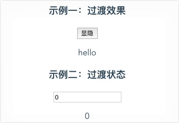

# API 进阶篇

## 数据驱动原理

通过 ES5 的 defineProperty 将 Vue 对象的属性全部转变为 getter/setter，然后配合 Dom 事件实现 Data 和 View 的双向绑定。由于属性转变为 getter/setter 只在 Vue 实例初始化时完成，所以新添加的属性不能双向绑定。而转变是在声明周期的哪一个阶段完成的呢？beforeMount 和 mounted 之间的阶段应该是正确答案，我们把他称为 mount  阶段。这个在 `src/demo/data-set.vue` Demo 中可以验证。 

如果想在组件的生命周期 mount 阶段之后再添加属性，需要使用 

    this.$set(this.someObject, 'objectAttributionName', attributionValue)

这里有一点文档中没有提到，如果一个属性对象使用了上面的方法，那么此对象会重新被转化，那些没有使用上面方法 set 的属性也会被转化。如果想添加多个属性，文档给了一个方法，使用 JS 的原生方法 Object.assign 来生成新对象替换原来的属性对象：

    this.someObject = Object.assign({}, this.someObject, { a: 1, b: 2 })

需要声明一点，上面所有添加新属性的方法都只能添加二级及以上的属性，无法添加 data 的根属性(一级属性)。

数据驱动 Dom 的改变是一个异步的过程，如果数据改变之后想要立即操作 Dom，这是的 Dom 可能还没有被更新，这是需要使用 $nextTick：

    methods: {
        updateMessage: function () {
          this.message = 'updated'
          console.log(this.$el.textContent) // => '没有更新'
          this.$nextTick(function () {
            console.log(this.$el.textContent) // => '更新完成'
          })
        }
    }

## 过渡效果和状态

过渡效果是显隐的过渡，过渡状态是值改变的过渡。

显隐的过渡分三类：v-if、v-show、数组对象中元素的增减。
先说前两种在过渡上他们并没有什么显著的差别。transition 可以有一个 name，缺省值是 v。进入和离开又各有两个状态，enter 和 leave 定义起始时的状态，enter-active 和 leave-active 定义动画过程和结束时的状态。如下面简单 Demo：`/src/demo/transition.vue`：

    Dom:
    

      <button v-on:click="show = !show">显隐</button>
      <transition>
        
hello

      </transition>
    

    
    Style:
    .v-enter-active, .v-leave-active {
      transition: opacity 3s
    }
  
    .v-enter, .v-leave-active {
      opacity: 0
    }

自定义过渡类名一般用不到，一种更好的实践是将自定义动画包装成组件。

    <transition
      name="custom-classes-transition"
      enter-active-class="animated tada"
      leave-active-class="animated bounceOutRight"
    >

同时使用 Transitions 和 Animations 时注意设置 type。(什么场景同时有过渡和动画？我没想到)

动画状态的两组钩子比较有用，可以配合 Velocity.js 实现更复杂的动画：

- beforeEnter enter afterEnter enterCancelled
- leaveEnter leave afterLeave leaveCancelled

多元素的过渡问题

过渡模式 -> 要写个 demo 研究一下多按钮的状态。

列表位移

requestAnimationFrame 