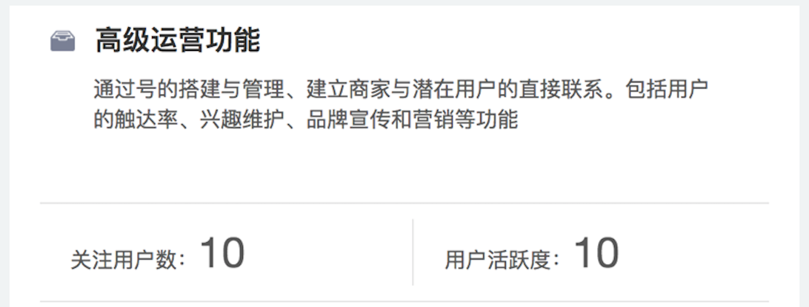

# API 基础篇

> Vue 的文档写的很棒，我们快速的过一遍 API，这篇是基础篇 API 的精简版。

## 安装&介绍&实例

关于安装和用法我们只讲正规军的主流套路，那些没有包管理和走下坡路的包管理方式我们直接略过。

vue 不支持 IE8 及以下浏览器。

好到这里"安装&介绍"这两部分已经没什么好讲的了，关于实例在 SPA 项目中一般只声明一次，其余的都是以组件的形式来集成。

    var vm = new Vue({
      // 选项
    });

也就是说上面这种用法大多数项目只出现一次，出现在入口文件中，在我们的演示项目中表现为：

    // main.js
    new Vue({
      el: '#app',
      router,
      template: '<App/>',
      components: { App }
    });

首先要在页面中初始化一个组件，el 就是指定组件在 Dom 树上的位置。router 是单页应用的路由，后面我们单独讲这个组件。template 是组件的模板，一般不这样用，当前这样用是因为 `main.js` 是入口文件，不方便独立写模板文件，并且模板足够简单。
我们注意到在 `index.html` 和 `App.vue` 中出现了同样的 `
`，那么我们去掉一个可以吗？

这里生命周期是一个重要知识点，生命周期的 8 个钩子需要记住，依次是：

- beforeCreate  数据观察和事件初始化之前
- created  数据观察和事件初始化完成
- beforeMount  模板编译之前
- mounted 模板编译完成
- beforeUpdate  数据更新前
- updated  数据更新完成
- beforeDestroy  组件销毁之前
- destroyed  组件销毁完成

## 模板语法

大括号绑定数据，语法很简单，如果想动态切换两份数据要怎么办？

    <template>
      

        <!-- ?? 这里要展现激活状态者的得分 ??-->
      

    </template>
    
    

v-once 的使用场景，前端静态数据，除了那两个数字都可以用 v-once 来提高性能：

v-bind:id 缩写为 :id，在 Dom 节点上与变量做互动只能使用此语法，下面语法是不可以的：

    

表达式不推荐用，html 中不适合写数据逻辑，计算是简单逻辑也建议挪到计算属性中。

指令全家福(v- 开头都是 vue 的指令)：

- v-once
- v-bind
- v-text 为了避免模板未解析时页面出现插值表达式
- v-html 直接输出 html，有安全隐患不建议使用
- v-show 对比 v-if 不重新渲染组件，只是隐藏，如果值为 false 里面的会渲染
- v-if 条件判断是否渲染 Dom 节点，如果值为 false 里面的不渲染
- v-else
- v-else-if
- v-for 循环
- v-on 事件绑定，缩写方式：v-on:click 等价 @click
- v-model 表单组件值得双向绑定
- v-pre 跳过编译直接展示，提高性能
- v-clock 比 v-text 更简单粗暴的一个方式，隐藏未编译的 Mustache 标签直到实例准备完毕

这里有一点需要注意，如果 `v-for` 和 `v-if` 在同一个节点上使用，那么 `v-for` 会被先执行，如果想要先执行 `v-if` 需要在外面包一层 `template`，将 `v-if` 写进 `template` 中。

## 计算属性

computed 计算属性值会缓存(与之对应的是 methods)，有 set 函数，适合多个值合成一个值的被动数据逻辑。
    
    // ...
    computed: {
      fullName: {
        // getter
        get: function () {
          return this.firstName + ' ' + this.lastName
        },
        // setter
        set: function (newValue) {
          var names = newValue.split(' ')
          this.firstName = names[0]
          this.lastName = names[names.length - 1]
        }
      }
    }
    // ...
    
watch 监听数据变化，适合一个值影响多个值的主动数据逻辑。

    watch: {
      a: function (val, oldVal) {
        console.log('new: %s, old: %s', val, oldVal)
      },
      // 方法名
      'b.a': 'someMethod',
      // 深度 watcher
      c: {
        handler: function (val, oldVal) { /* ... */ },
        deep: true
      }
    }

## 条件渲染 和 列表渲染

条件渲染有一个容易忽略的知识点，用 Key 管理可复用元素：

    <template v-if="loginType === 'username'">
      <label>Username</label>
      <input placeholder="Enter your username" key="username-input">
    </template>
    <template v-else>
      <label>Email</label>
      <input placeholder="Enter your email address" key="email-input">
    </template>

如果不加 `key`，在不 `loginType` 件下 `input` 是同一个 `input`，这样是不合理的。但是在 `label` 上是合理并且高效的。`key` 的作用在 `v-for` 上同样很有用，具体参见演示 Demo(路径 src/demo/key)。

`v-for` 有三种遍历对象：数组，对象，数字。其中数组的 7 个方法会触发视图更新：

- push()
- pop()
- shift()
- unshift()
- splice()
- sort()
- reverse()

需要注意的是有两种情况不会触发视图更新，需要换种变通写法：

- 当你利用索引直接设置一个项时，例如： vm.items[indexOfItem] = newValue
- 当你修改数组的长度时，例如： vm.items.length = newLength

变通：

- Vue.set(example1.items, indexOfItem, newValue)
- example1.items.splice(newLength)

## 事件处理

主要三块内容：

一、支持的事件列表，其实就是 Dom 原生事件，这里不展开；

二、10 个修饰符；

- .stop - 调用 event.stopPropagation()。
- .prevent - 调用 event.preventDefault()。
- .capture - 添加事件侦听器时使用 capture 模式。
- .self - 只当事件是从侦听器绑定的元素本身触发时才触发回调。
- .{keyCode | keyAlias} - 只当事件是从特定键触发时才触发回调。
- .native - 监听组件根元素的原生事件。
- .once - 只触发一次回调。
- .left - (2.2.0) 只当点击鼠标左键时触发。
- .right - (2.2.0) 只当点击鼠标右键时触发。
- .middle - (2.2.0) 只当点击鼠标中键时触发。

三、组件的自定义事件；

还有两个小尾巴：`$event` 和 `keyAlias`

    // 可以使用 v-on:keyup.f1
    Vue.config.keyCodes.f1 = 112

## 表单控件绑定

主要的语法就是 `v-model`，表单元素：input, checkbox,radio,select。

input 和 radio 最简单，`v-model` 对应的值就是 input 的输入值 和 被选中 radio 的 value 值。

checkout 分单个和多个组合，如果是单个又有两种用法：

    // v-model 直接对应是否选中的布尔值
    <input type="checkbox" id="checkbox" v-model="checked">
    // checked 是布尔值，数据双向绑定
    
    // v-module 对应不同逻辑值
    <input
      type="checkbox"
      v-model="toggle"
      v-bind:true-value="a"
      v-bind:false-value="b"
    >
    // 当选中时
    vm.toggle === vm.a
    // 当没有选中时
    vm.toggle === vm.b
    
如果是多个组合 `v-model` 对应选中的 checkbox 的 value 组成数组。

单选 select 其实是变形的 radio 组，多选的 select 和 checkbox 组类似，不同的是如果没有 option 没有设置 value 可以取 text。如果想 text 和 value 都需要，那么将 value 设为对象

    <select v-model="selected" multiple>
        <option v-for="item in items" :value="item">{{item.text}}</option>
    </select>

